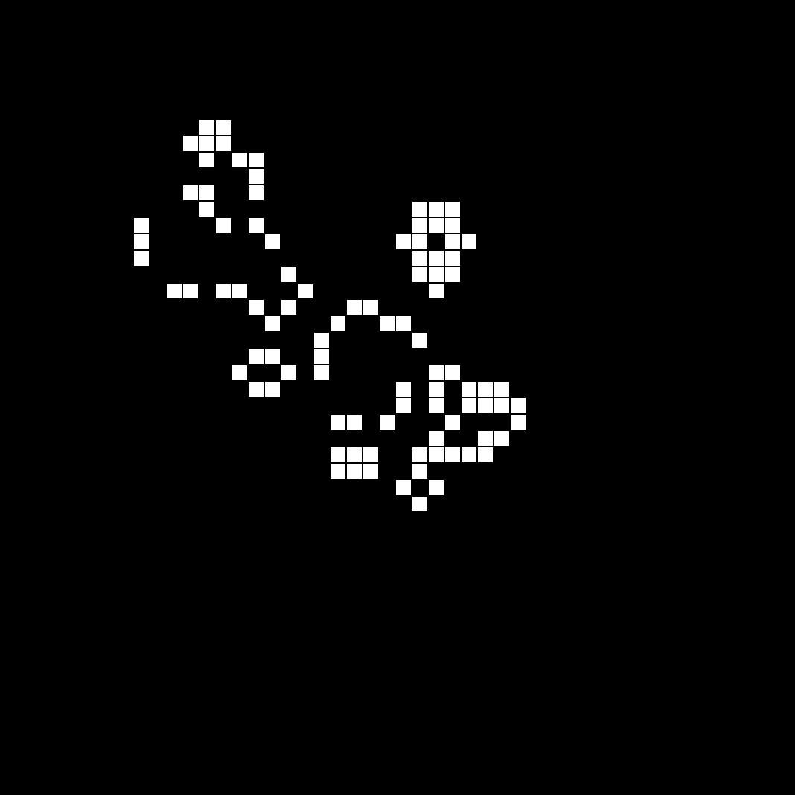

# Conway's Game of Life

Conway's Game of Life is a cellular automaton simulation that demonstrates emergent behavior from simple rules. Cells on a grid evolve over generations based on the state of their neighbors.



## Getting Started

To run the Game of Life simulation, simply open the `index.html` file in a web browser. You can interact with the simulation using the provided buttons and observe how different patterns evolve over time.

## Features

- Start and stop the simulation.
- Progress the simulation step by step.
- Reset the grid to its initial state.
- View the rules of Conway's Game of Life.

## How to Play

1. **Start and Stop**: Use the "Start" and "Stop" buttons to control the continuous simulation. Watch how the cells evolve over generations.

2. **Next Step**: Use the "Next Step" button to progress the simulation one step at a time. This allows you to observe how individual cells change state.

3. **Reset**: The "Reset" button clears the grid and stops the simulation. You can start with a clean slate or set up your own initial configuration.

4. **Rules**: Click the "Rules" button to learn about the rules that govern the evolution of cells in Conway's Game of Life.

## Customize

Feel free to modify the grid dimensions, speed of simulation, or add your own initial patterns to the `index.html` file's JavaScript section.

```
const rows = 50;
const cols = 50;
const liveCell = 1;
const deadCell = 0;
// ... (other variables and functions)
```

## License

This project is licensed under the MIT License - see the [LICENSE](LICENSE) file for details.

---
